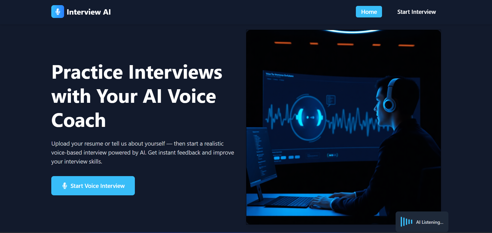
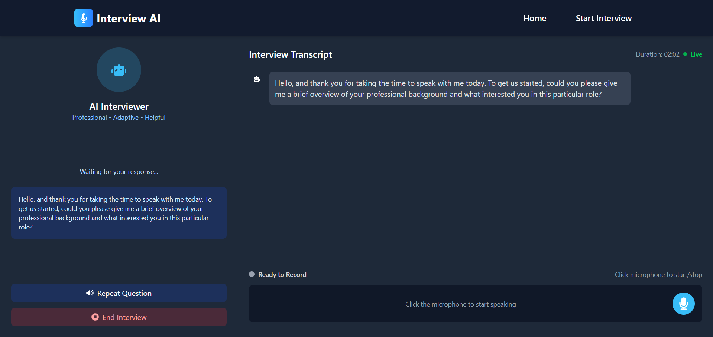

# Interview AI 🤖
Website: [https://interviewai-frontend.vercel.app](https://interviewai-frontend.vercel.app)

An intelligent interview preparation platform that helps you practice interviews with AI-powered conversations, analyze your resume, and get detailed performance summaries. Built with modern web technologies and powered by Google's Gemini AI.


## ✨ Features

- **🎯 AI-Powered Interview Practice**: Interactive voice-based conversations with real-time speech recognition using Google Gemini AI
- **📄 Resume Analysis**: Upload and analyze PDF resumes with AI-powered feedback and improvement suggestions
- **📊 Interview Summaries**: Comprehensive session summaries with performance analysis and actionable insights
- **🎨 Modern UI/UX**: Beautiful, responsive interface built with React and Tailwind CSS
- **🗣️ Voice Recognition**: Real-time speech-to-text conversion for natural interview conversations
- **🧠 Memory Management**: Intelligent conversation context using Mem0AI for personalized experiences
- **📱 Mobile-Friendly**: Fully responsive design that works on all devices

## 🛠️ Tech Stack

### Frontend
- **React** - Latest React with modern features
- **Vite** - Fast build tool and development server
- **Redux Toolkit** - State management
- **React Router** - Client-side routing
- **Tailwind CSS** - Utility-first CSS framework
- **React Speech Recognition** - Voice input processing
- **Axios** - HTTP client for API communication
- **Sonner** - Toast notifications

### Backend
- **Node.js** - JavaScript runtime
- **Express.js** - Web application framework
- **LangChain/LangGraph** - AI/LLM application framework
- **Google Generative AI** - Gemini AI model for intelligent conversations
- **Mem0AI** - Memory management for conversation context
- **MongoDB** - Database for session persistence
- **PDF Parse** - PDF text extraction
- **Multer** - File upload handling
- **BullMQ** - Job queue management

### Infrastructure
- **Docker Compose** - Container orchestration
- **Environment Variables** - Secure configuration management

## 🚀 Quick Start

### Prerequisites

- Node.js (v18 or higher)
- npm or yarn
- MongoDB (local or cloud)
- Google AI API key

### Installation

1. **Clone the repository**
   ```bash
   git clone https://github.com/dhruvagrawal1080/InterviewAI.git
   cd interview-ai
   ```

2. **Set up environment variables**

   Create `.env` file in the `backend/` directory:

   **Backend (.env)**
   ```env
   PORT=3000
   FRONTEND_URL=http://localhost:5173
   GOOGLE_API_KEY=your_google_gemini_api_key_here
   MONGODB_URI=your_mongodb_connection_string_here
   ```

3. **Install backend dependencies**
   ```bash
   cd backend
   npm install
   ```

4. **Install frontend dependencies**
   ```bash
   cd frontend
   npm install
   ```

5. **Start the development servers**

   **Backend (Terminal 1)**
   ```bash
   cd backend
   npm run dev
   ```

   **Frontend (Terminal 2)**
   ```bash
   cd frontend
   npm run dev
   ```

6. **Open your browser**
   Navigate to `http://localhost:5173` to access the application.

## 📖 Usage

1. **Upload Resume**: Upload your PDF resume for AI analysis and personalized interview preparation
2. **Start Interview**: Begin an AI-powered interview session with voice recognition
3. **Practice Conversations**: Engage in realistic interview scenarios with contextual follow-up questions
4. **Review Summary**: Get comprehensive performance analysis and improvement suggestions

## 🔧 Configuration

### API Keys Setup

1. **Google AI API**: Get your API key from [Google AI Studio](https://makersuite.google.com/app/apikey)
2. **MongoDB**: Set up a MongoDB database (local or cloud) for session storage

### Environment Variables

| Variable | Description | Default |
|----------|-------------|---------|
| `PORT` | Backend server port | `3000` |
| `FRONTEND_URL` | Frontend URL for CORS | `http://localhost:5173` |
| `GOOGLE_API_KEY` | Google AI API key | Required |
| `MONGODB_URI` | MongoDB connection string | Required |

## 🏗️ Project Structure

```
interview-ai/
├── backend/
│   ├── controllers/                       
│   │   ├── cheakResume.controller.js      # Resume analysis logic
│   │   ├── interview.controller.js        # Interview chat handling
│   │   └── interviewSummary.controller.js # Summary generation
│   ├── routes/              
│   │   ├── resume.route.js                # Resume upload endpoints
│   │   ├── interview.route.js             # Interview chat endpoints
│   │   └── summary.route.js               # Summary generation endpoints
│   ├── utils/              
│   │   ├── addMemory.js                   # Memory management
│   │   ├── retriveAllMemory.js            # Memory retrieval
│   │   └── retriveRelevantMemory.js       # Context-aware memory
│   ├── docker-compose.yml   
│   ├── package.json        
│   └── server.js          
├── frontend/
│   ├── src/
│   │   ├── components/       
│   │   │   ├── homePageComponents/        # Landing page components
│   │   │   ├── InterviewRoute.jsx         # Interview page wrapper
│   │   │   ├── Navbar.jsx                 # Navigation component
│   │   │   └── UploadBox.jsx              # File upload component
│   │   ├── pages/           
│   │   │   ├── HomePage.jsx               # Landing page
│   │   │   ├── InterviewPage.jsx          # Interview interface
│   │   │   ├── SummaryPage.jsx            # Summary display
│   │   │   └── UploadPage.jsx             # Resume upload
│   │   ├── slices/        
│   │   │   ├── generalInfo.slice.js
│   │   │   ├── messages.slice.js
│   │   │   └── summary.slice.js
│   │   ├── util/         
│   │   │   └── pingServer.js              # Server health check
│   │   ├── assets/         
│   │   │   └── homePage.png           
│   │   ├── App.jsx          
│   │   └── main.jsx       
│   ├── public/              
│   └── package.json          
└── README.md                 
```

## 🔧 API Endpoints

### Resume Analysis
- `POST /api/check` - Upload and analyze resume PDF

### Interview Chat
- `POST /api/ask` - Send interview question/response

### Interview Summary
- `POST /api/summary` - Generate interview session summary

## 🤝 Contributing

1. Fork the repository
2. Create a feature branch (`git checkout -b feature/amazing-feature`)
3. Commit your changes (`git commit -m 'Add some amazing feature'`)
4. Push to the branch (`git push origin feature/amazing-feature`)
5. Open a Pull Request

---

**Made with ❤️ for intelligent interview preparation**
